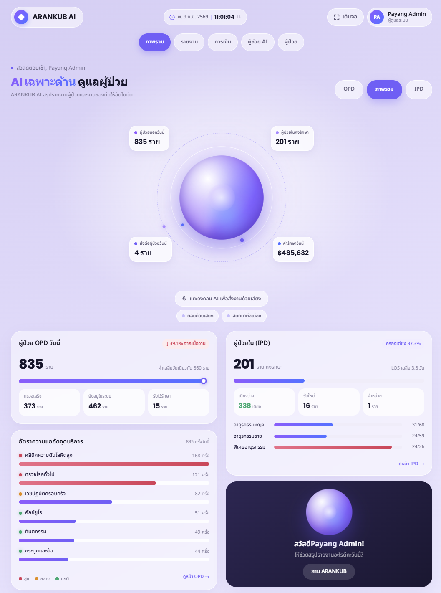
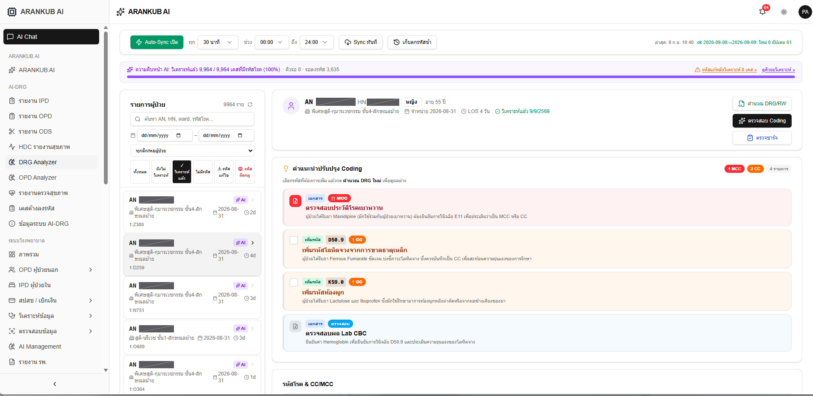
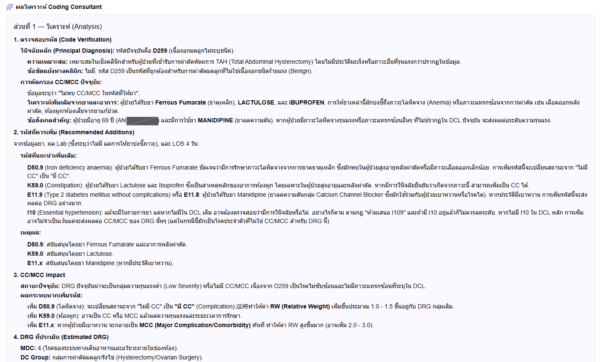
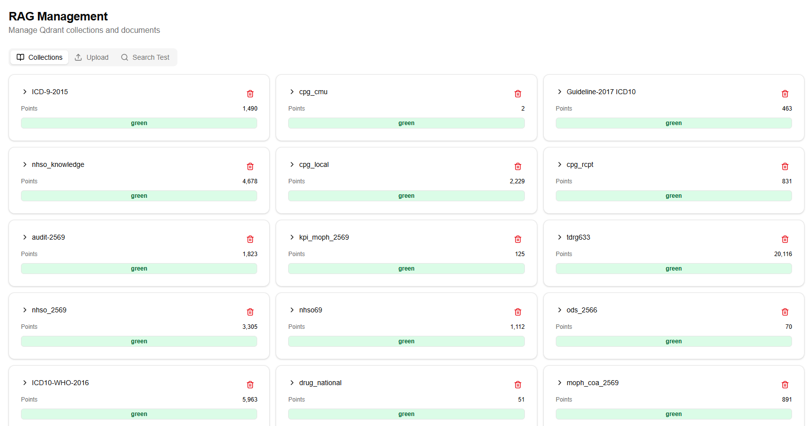

# ARANKUB

**ระบบ AI ช่วยงานข้อมูลโรงพยาบาล — ลงรหัสโรค ตรวจสอบการเบิกจ่าย และวิเคราะห์ข้อมูลผู้ป่วย**

พัฒนาและใช้งานจริงที่โรงพยาบาลอรัญประเทศ จังหวัดสระแก้ว ตั้งแต่ปี 2569
เชื่อมต่อกับ HosXP โดยตรง ทำงานทั้งหมดภายในเครือข่ายของโรงพยาบาล ไม่ส่งข้อมูลผู้ป่วยออกนอกองค์กร



<sub>หน้าภาพรวม — สรุปผู้ป่วยนอก/ผู้ป่วยใน ความหนาแน่นแต่ละจุดบริการ และการครองเตียง
อัปเดตจากข้อมูลจริงใน HosXP · สั่งงานด้วยเสียงภาษาไทยได้</sub>

---

## ปัญหาที่ระบบนี้แก้

โรงพยาบาลรัฐเสียรายได้จากงานเอกสารที่คนทำไม่ทัน — ลงรหัสโรคไม่ครบทำให้ได้ค่า RW ต่ำกว่าที่ควร
เคสถูก สปสช. ปฏิเสธแล้วไม่มีใครตามแก้ ข้อมูล 43 แฟ้มผิดจนถูกตัดคะแนน
ปัญหาเหล่านี้ไม่ได้แก้ด้วยการจ้างคนเพิ่ม เพราะคนที่มีความรู้เฉพาะทางหายาก

ARANKUB ใช้ AI ที่รันในองค์กรช่วยงานส่วนที่ซ้ำและตรวจได้ด้วยกฎ เหลือการตัดสินใจไว้ให้คน

| งาน | เดิม | หลังใช้ระบบ |
|---|---|---|
| ตรวจความครบถ้วนของรหัสโรคผู้ป่วยใน | ไล่อ่านชาร์จทีละใบ | ระบบคัดเคสที่น่าจะได้ RW เพิ่มขึ้นมาให้ก่อน |
| ตามผลตรวจสอบ REP จาก สปสช. | ดาวน์โหลดเองทุกเดือน แล้วเปิดดูใน Excel | ดึงอัตโนมัติ แยกรหัสปฏิเสธ พร้อมแนวทางแก้รายเคส |
| ตรวจข้อมูล 43 แฟ้ม | รอผลจากส่วนกลาง | ตรวจเองทุกคืนตามคู่มือ v2.4 |
| ส่งยาที่บ้าน | จดในกระดาษ โทรตาม | มอบหมายไรเดอร์ ถ่ายรูปยืนยัน คำนวณค่าตอบแทน |

---

## ลองใช้งานเดโม

รันหน้าจอจริงของระบบบนเครื่องของท่านได้ภายในไม่กี่นาที ต้องมีแค่ Node.js 20
ไม่ต้องมีฐานข้อมูล ไม่ต้องมี HosXP

```bash
git clone https://github.com/payang24-DRCOMP/ARANKUB
cd ARANKUB/demo
npm install
npm run dev
```

เปิด http://localhost:3000 — **ข้อมูลทั้งหมดเป็นข้อมูลจำลอง ไม่มีข้อมูลผู้ป่วยจริง**

รายละเอียดว่าเดโมต่างจากระบบจริงอย่างไร → [demo/README.md](demo/README.md)

---

## เกี่ยวกับที่เก็บนี้

ที่เก็บนี้เป็น**เอกสารประกอบระบบ พร้อมเดโมหน้าจอ** — อธิบายว่าระบบทำอะไรได้ ต้องใช้อะไร และติดตั้งอย่างไร

ซอร์สโค้ดฉบับเต็มไม่ได้เผยแพร่ที่นี่ (มีเฉพาะเดโมหน้าจอ) เพราะระบบผูกกับโครงสร้างข้อมูลของ HosXP
และเกณฑ์ของ สปสช. ที่เปลี่ยนทุกปี การนำไปใช้จึงต้องปรับให้เข้ากับหน่วยบริการแต่ละแห่ง
และตามแก้เมื่อเกณฑ์เปลี่ยน ไม่ใช่การคัดลอกไฟล์ไปวางแล้วใช้ได้เลย

หน่วยงานที่สนใจนำไปใช้ หรืออยากแลกเปลี่ยนแนวทาง ดู[ช่องทางติดต่อ](#ติดต่อ)ท้ายหน้า

---

## ระบบประกอบด้วยอะไร

แบ่งเป็นโมดูลที่เปิด-ปิดแยกกันได้ — ติดตั้งเฉพาะที่ใช้ แล้วเพิ่มทีหลังได้โดยไม่ต้องรื้อระบบ

### แกนกลาง — ติดตั้งทุกที่

ผู้ใช้และสิทธิ์ · ตั้งค่าระบบ · คลังความรู้สำหรับค้นหา · เชื่อมต่อ HosXP · บันทึกการใช้งาน

### โมดูลหลัก

| โมดูล | ทำอะไร |
|---|---|
| **IPD / DRG Analyzer** | ตรวจความครบถ้วนของรหัสโรคผู้ป่วยใน เทียบกับ ThaiDRG แนะนำรหัสที่อาจตกหล่น พร้อมเตือนรหัสต้องห้าม |
| **OPD Analyzer** | ตรวจรหัสและค่าใช้จ่ายผู้ป่วยนอก คัดเคสที่ลงรหัสไม่สอดคล้องกับบริการที่ให้ |
| **ODS ผ่าตัดวันเดียว** | คัดกรองเคสตามเกณฑ์ สปสช. 65 กลุ่ม จากรหัสหัตถการและวินิจฉัย |
| **REP ผลตรวจสอบ สปสช.** | ดึงผลตรวจสอบอัตโนมัติ แยกรหัสปฏิเสธพร้อมแนวทางแก้ ติดตามได้รายเคส |
| **กองทุน / การเบิกจ่าย** | ภาพรวมรายได้ตามกองทุน แนวโน้มย้อนหลัง ติดตามการเบิกจ่ายรายตัว |
| **Dashboard โรงพยาบาล** | สถิติ OPD/IPD, 10 โรคที่พบบ่อย, NCD, ข้อมูล real-time จาก HosXP |
| **ผู้ช่วย AI** | ถามข้อมูลโรงพยาบาลเป็นภาษาไทย อ้างอิงจากเอกสารและฐานข้อมูลจริง |

### ส่วนเสริม

| โมดูล | ทำอะไร |
|---|---|
| **ส่งยาที่บ้าน** | มอบหมายไรเดอร์ พิมพ์ฉลาก+QR ถ่ายรูปยืนยันรับ-ส่ง คำนวณค่าตอบแทน ตรวจตกเบิก |
| **ลูกหนี้ / การเงิน** | นำเข้าใบแจ้งยอด กระทบยอดกับใบเสร็จ ติดตามยอดค้างรายกองทุน |
| **ประกันสังคม** | นำเข้าไฟล์จัดสรร อ่านยอดรับจริงจาก PDF สแกนด้วย OCR ติดตามรายตัว |
| **ตรวจคุณภาพ 43 แฟ้ม** | ตรวจตามคู่มือ v2.4 อัตโนมัติทุกคืน ชี้จุดที่ต้องแก้ |
| **HDC รายงานสุขภาพ** | ดึงตัวชี้วัดจาก opendata กระทรวง เทียบระดับ รพ./อำเภอ/จังหวัด |
| **รายงานตรวจสุขภาพ** | ใบรายงานรายบุคคลและสรุปรายหน่วยงาน อิงค่าปกติจาก HosXP |
| **เครื่องมือข้อมูล** | เขียน SQL สร้างรายงานและ Dashboard เองได้ |

รายละเอียดครบทุกโมดูล พร้อมสิ่งที่ต้องเตรียมของแต่ละตัว → [docs/MODULES.md](docs/MODULES.md)

---

## ตัวอย่างการใช้งาน

### ตรวจความครบถ้วนของรหัสโรคผู้ป่วยใน



ระบบดึงเคสจาก HosXP มาวิเคราะห์อัตโนมัติ แล้วเสนอรหัสที่อาจตกหล่นพร้อมเหตุผล —
เช่น ผู้ป่วยได้รับ Ferrous Fumarate จึงควรตรวจสอบภาวะโลหิตจาง (D50.9) ซึ่งนับเป็น CC
ผู้ให้รหัสเป็นคนตัดสินใจว่าจะเพิ่มหรือไม่ แล้วกดคำนวณ DRG ใหม่เพื่อดูผลต่าง

### ผลวิเคราะห์แบบละเอียด พร้อมเหตุผลอ้างอิง



ทุกข้อเสนอมีที่มา — อ้างอิงจากยาที่ผู้ป่วยได้รับ ผลแล็บ ระยะเวลานอน และเกณฑ์ใน DCL
พร้อมประเมินว่าถ้าเพิ่มรหัสแล้ว RW จะเปลี่ยนไปเท่าไร
ระบบยังเตือนรหัสต้องห้ามด้วย เช่น I109 ที่ห้ามเสนอตามกฎ

### คลังความรู้ที่ระบบใช้อ้างอิง



เกณฑ์ สปสช. รหัส ICD ประกาศกระทรวง และแนวทางเวชปฏิบัติ ถูกนำเข้าเป็นคลังความรู้
ที่ค้นได้ — เมื่อเกณฑ์เปลี่ยน อัปเดตที่นี่โดยไม่ต้องแก้โค้ด

<sub>ภาพทั้งหมดมาจากระบบที่ใช้งานจริง เลขระบุตัวผู้ป่วย (HN / AN) ถูกปิดทับก่อนเผยแพร่</sub>

---

## สิ่งที่ต้องมี

### เครื่องแม่ข่าย

สเปกขึ้นกับว่าจะใช้โมดูลที่ต้องประมวลผลด้วย AI หรือไม่

| | ไม่ใช้ AI | ใช้ AI (แนะนำ) |
|---|---|---|
| CPU | 4 cores | 8 cores ขึ้นไป |
| RAM | 16 GB | 32 GB ขึ้นไป |
| พื้นที่ | SSD 256 GB | SSD 512 GB ขึ้นไป |
| การ์ดจอ | ไม่ต้องมี | NVIDIA VRAM 12 GB ขึ้นไป |

**โมดูลที่ต้องใช้ AI:** IPD/DRG Analyzer · OPD Analyzer · ODS · ผู้ช่วย AI · การอ่านเอกสารสแกน

**เรื่องการ์ดจอที่ควรรู้ก่อนจัดหา**

- โมเดลภาษาขนาด 9B ที่ระบบใช้ต้องการ VRAM ประมาณ 9 GB — การ์ด 12 GB (เช่น RTX 3060 12GB) พอดี ส่วนการ์ด 8 GB ไม่พอ
- ถ้าจะใช้ OCR อ่านชาร์จควบคู่กับงานวิเคราะห์รหัส **ควรมีการ์ด 2 ใบ** เพราะ OCR กินการ์ดทั้งใบระหว่างทำงาน มีใบเดียวจะแย่งกันจนช้าทั้งคู่
- ไม่มีการ์ดจอก็รันได้ แต่ระบบจะใช้ CPU แทนซึ่งช้ากว่ามากจนไม่เหมาะกับงานประจำวัน
- พื้นที่ SSD ต้องเผื่อสำหรับโมเดลภาษาประมาณ 20 GB

### ซอฟต์แวร์ที่ต้องติดตั้งบนเครื่อง

| รายการ | เวอร์ชัน | จำเป็นเมื่อ |
|---|---|---|
| Ubuntu Server | 22.04 LTS ขึ้นไป | เสมอ |
| PostgreSQL | 16 ขึ้นไป | เสมอ — ฐานข้อมูลของระบบ คนละตัวกับ HosXP |
| Node.js | 20 LTS ขึ้นไป | เสมอ — รันส่วนเว็บ |
| Python | 3.11 ขึ้นไป | เสมอ — รันบริการ AI และตัวเชื่อมข้อมูล |
| Docker | 24 ขึ้นไป | แนะนำ — ติดตั้งแบบชุดเดียวจบ |
| Qdrant | ล่าสุด | ใช้โมดูลที่ต้อง AI — เก็บคลังความรู้ |
| Ollama | ล่าสุด | ใช้โมดูลที่ต้อง AI — รันโมเดลภาษาบนเครื่อง |
| ไดรเวอร์ NVIDIA | 550 ขึ้นไป | เครื่องที่มีการ์ดจอ |
| Reverse proxy | Caddy หรือ Nginx | เสมอ — สำหรับ HTTPS |

### ระบบสารสนเทศโรงพยาบาล

**รองรับ HosXP XE เท่านั้น** (MySQL / MariaDB) — หน่วยบริการที่ใช้ JHCIS หรือ HIS อื่น
ต้องพัฒนาตัวเชื่อมต่อเพิ่ม

ต้องขอจากผู้ดูแล HosXP:

- บัญชีผู้ใช้ฐานข้อมูลแบบ **อ่านอย่างเดียว** (`SELECT` เท่านั้น) — ระบบไม่เขียนข้อมูลกลับเข้า HosXP ในทุกกรณี
- เปิดให้เครื่องที่ติดตั้งระบบเชื่อมต่อพอร์ต MySQL ได้ (ปกติ 3306)

ตารางที่ต้องมีครบ — ระบบมีเครื่องมือตรวจให้อัตโนมัติหลังติดตั้ง:

`patient` · `ovst` · `ovstdiag` · `opitemrece` · `an_stat` · `ipt` · `iptdiag` · `icd101` · `ward` · `drugitems`

### เครือข่ายและโดเมน

- **ต้องเข้าใช้ผ่าน HTTPS** ไม่ใช่ผ่านหมายเลข IP โดยตรง เพราะเบราว์เซอร์ไม่อนุญาตให้ใช้
  ไมโครโฟน กล้อง และการแจ้งเตือนบนหน้าเว็บที่ไม่ใช่ HTTPS ซึ่งเป็นสิ่งที่การสั่งงานด้วยเสียง
  การสแกน QR และการแจ้งเตือนไรเดอร์ต้องใช้
- ใบรับรอง SSL ใช้ของฟรีได้ (Let's Encrypt)
- ถ้าต้องการให้ไรเดอร์ใช้งานนอกโรงพยาบาล ต้องเปิดให้เข้าถึงจากอินเทอร์เน็ตได้
  ผ่าน reverse proxy หรือ tunnel — ไม่จำเป็นต้องมี IP จริง

### บัญชีภายนอกที่ต้องขอเอง

บัญชีเหล่านี้เป็นของหน่วยบริการ ขอแทนกันไม่ได้ และบางรายการใช้เวลาอนุมัติหลายสัปดาห์

| บัญชี | ใช้กับโมดูล | ขอจาก |
|---|---|---|
| eClaim (พร้อม TOTP) | REP, Seamless | สปสช. |
| Provider ID | ล็อกอินด้วยบัญชี สธ. | กระทรวงสาธารณสุข |
| ระบบประกันสังคม | ประกันสังคม | สปส. |

ไม่มีบัญชีเหล่านี้ก็ติดตั้งได้ เพียงแต่โมดูลที่เกี่ยวข้องจะใช้งานไม่ได้

รายละเอียดทั้งหมด → [docs/REQUIREMENTS.md](docs/REQUIREMENTS.md) · ขั้นตอนติดตั้ง → [docs/INSTALL.md](docs/INSTALL.md)

---

## โครงสร้างระบบ

```
                    ผู้ใช้ (เบราว์เซอร์ / มือถือ)
                              │
                         HTTPS │
                              ▼
                    ┌─────────────────────┐
                    │   ARANKUB Web       │  หน้าจอทั้งหมด สิทธิ์ผู้ใช้
                    │   Next.js  :3000    │  ตรรกะทางธุรกิจ
                    └──────────┬──────────┘
                               │
              ┌────────────────┼────────────────┐
              ▼                ▼                ▼
      ┌───────────────┐ ┌─────────────┐ ┌──────────────┐
      │  AI Service   │ │  Connector  │ │  PostgreSQL  │
      │    :8008      │ │    :8000    │ │    :5432     │
      │               │ │             │ │              │
      │ RAG / OCR     │ │ ดูด HosXP   │ │ ข้อมูลระบบ    │
      │ LLM / Grouper │ │ นำเข้า REP  │ │              │
      └───────┬───────┘ └──────┬──────┘ └──────────────┘
              │                │
       ┌──────┴──────┐         ▼
       ▼             ▼    ┌──────────┐
  ┌─────────┐  ┌─────────┐│  HosXP   │  อ่านอย่างเดียว
  │ Qdrant  │  │ Ollama  ││  MySQL   │  ไม่แก้ข้อมูลต้นทาง
  │  :6333  │  │ :11434  │└──────────┘
  └─────────┘  └─────────┘
```

**ข้อมูลผู้ป่วยไม่ออกจากเครือข่ายโรงพยาบาล** — โมเดลภาษาและระบบค้นหาเอกสารรันบนเครื่องของโรงพยาบาลเอง
ไม่เรียกใช้บริการ AI จากภายนอก

รายละเอียดการติดตั้ง → [docs/INSTALL.md](docs/INSTALL.md)

---

## ความปลอดภัยและ PDPA

- ล็อกอินด้วยรหัสผ่าน หรือ **Provider ID ของกระทรวงสาธารณสุข**
- ยืนยันตัวตนสองขั้นตอน (2FA) ด้วยแอป Authenticator บังคับได้รายบุคคล
- สิทธิ์แบ่งตามโมดูล บังคับใช้ 3 ชั้น — ก่อนเข้าหน้า ก่อนโหลดหน้า และที่ API
- โมดูลที่มีข้อมูลรายบุคคลถูกทำเครื่องหมายแยก ต้องได้รับอนุมัติจากผู้ดูแลเสมอ
- บันทึกการเปลี่ยนสิทธิ์ทุกครั้ง พร้อมผู้ทำและเวลา
- ข้อมูลทั้งหมดอยู่บนเครื่องของโรงพยาบาล ตอบคำถามผู้ตรวจสอบได้ว่าข้อมูลแต่ละอย่างเก็บที่ตารางไหน

---

## สถานะ

ระบบใช้งานจริงที่โรงพยาบาลอรัญประเทศ ครอบคลุมงานผู้ป่วยในและผู้ป่วยนอก การเบิกจ่าย สปสช.
ประกันสังคม และงานส่งยาที่บ้าน

ขณะนี้อยู่ระหว่างจัดระบบให้แยกเป็นโมดูลและเตรียมชุดติดตั้ง เพื่อให้หน่วยบริการอื่นนำไปใช้ได้

---

## ร่วมสนับสนุนการพัฒนา

ระบบนี้พัฒนาขึ้นจากปัญหาหน้างานจริงของโรงพยาบาลรัฐ และยังพัฒนาต่อเนื่องอยู่
หน่วยงานที่สนใจสามารถร่วมสนับสนุนได้หลายทาง

- **ร่วมทดสอบเป็นหน่วยบริการนำร่อง** — ช่วยให้ระบบรองรับความหลากหลายของข้อมูลได้จริง
  ไม่ใช่ทำงานได้แค่ที่เดียว
- **แลกเปลี่ยนความรู้เชิงเกณฑ์** — การตีความเกณฑ์ สปสช. รหัส ODS หรือโครงสร้าง 43 แฟ้ม
  ที่ต่างมุมมองกัน ทำให้ระบบตรวจได้แม่นขึ้นสำหรับทุกคน
- **แจ้งปัญหาและข้อเสนอแนะ** — เปิด [Issue](https://github.com/payang24-DRCOMP/ARANKUB/issues)
  บอกได้ว่างานส่วนไหนที่โรงพยาบาลของท่านยังไม่มีเครื่องมือช่วย
- **สนับสนุนทรัพยากรในการพัฒนา** — เครื่องและการ์ดจอสำหรับทดสอบ หรือการสนับสนุนรูปแบบอื่น
  ที่ช่วยให้พัฒนาต่อได้

---

## ติดต่อ

**โรงพยาบาลอรัญประเทศ** จังหวัดสระแก้ว

เปิด [Issue](https://github.com/payang24-DRCOMP/ARANKUB/issues) ในที่เก็บนี้
เพื่อสอบถามรายละเอียด ขอชมการสาธิตระบบ หรือพูดคุยเรื่องการนำไปใช้

---

<sub>ARANKUB · พัฒนาโดยโรงพยาบาลอรัญประเทศ เพื่อโรงพยาบาลรัฐ</sub>
